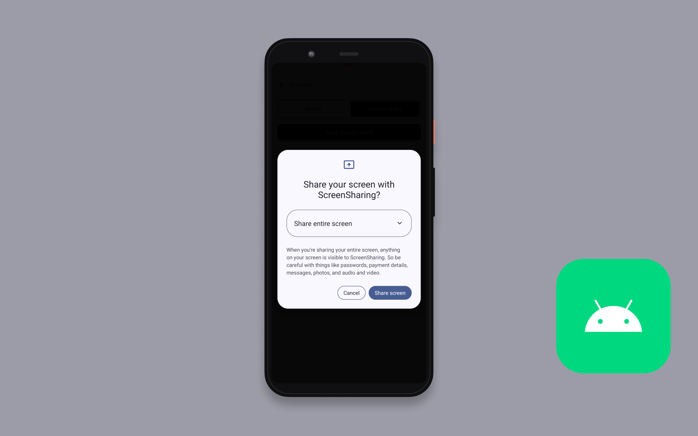

# Amazon IVS Real-time Screenshare for Android Demo

A demo Android application built with Jetpack Compose intended as an educational tool to demonstrate how you can share your device screen to an Amazon IVS Stage.

> [!CAUTION] 
> **Use at Your Own Risk: This code sample is provided as a reference implementation for educational and demonstration purposes.** 
> It is **not** intended for production use. Its primary goal is to help you understand the concepts and capabilities of Amazon IVS. **DO NOT** use this solution in any production environment. By us ing this solution, you understand and accept its risks and limitations.
>
> While functional, users should be aware of the following considerations:
>
> - **Device Compatibility Warnings**
>   - Older Device Users: This implementation may experience stability issues on certain older Android devices, particularly those with limited processing power or memory constraints
>   - Memory Limitations: The application may approach or exceed device memory limits during use, potentially resulting in crashes or unexpected behavior
>   - Performance Variability: Performance may vary significantly across different device types,Android versions, and hardware configurations
>   - API Level Requirements: This application requires Android API level 29 (Android 10) or higher
> - **Recommendations**
>   - Test your implementation thoroughly on your target devices before rolling out screenshare in production
>   - Monitor memory usage during development and testing
>   - Consider implementing additional memory management strategies for production applications
>   - Newer devices with enhanced processing capabilities typically provide better performance and stability

This sample code is intended to demonstrate Amazon IVS capabilities and should be adapted and optimized for your specific production requirements.

## Prerequisites

- Android Studio (latest stable version recommended)
- Android device running API level 29 (Android 10) or higher
- Active Amazon Web Services (AWS) account
- Amazon IVS Stage token

## Setup

1. Clone the repository to your local machine.
2. Open the project in Android Studio.
3. Sync the project to download all dependencies automatically via Gradle.
4. Build and run the project on either:
   - **Android Emulator**: Use an emulator running API level 29 or higher with sufficient RAM allocated (recommended: 4GB+)
   - **Physical Android Device**: For optimal performance, especially on older development machines
     1. Enable Developer Options on your Android device
     2. Enable USB Debugging in Developer Options
     3. Connect your device to your computer via USB
     4. Accept the USB debugging prompt on your device

## Application Usage

Upon launching the application, you will be asked to provide an IVS Stage token to proceed. You must create an IVS stage to create a stage token. Take the following steps:

1. Create an IVS Stage by taking the steps described in the documentation: [Create a Stage](https://docs.aws.amazon.com/ivs/latest/RealTimeUserGuide/getting-started-create-stage.html#getting-started-create-stage-console).
2. Create a stage token taking the steps described in the documentation: [Distribute Participant Tokens](https://docs.aws.amazon.com/ivs/latest/RealTimeUserGuide/getting-started-distribute-tokens.html).
3. Copy and paste the stage token into the input field in the application.
4. Tap "Join Stage" to connect to the IVS stage.
5. Once connected, tap "Start screen share" to begin sharing your device screen.
6. The app will request screen capture permissions - grant these permissions to proceed.
7. Your screen will now be shared to the IVS stage and visible to other participants.

**IMPORTANT NOTE:** Joining a stage and streaming in the app will create and consume AWS resources, which will cost money.

## Known Issues

- A list of known issues for the Amazon IVS Broadcast SDK is available on the following page: [Amazon IVS Real-Time SDK: Android Guide](https://docs.aws.amazon.com/ivs/latest/RealTimeUserGuide/broadcast-android-known-issues.html)
- Performance may vary on devices with limited RAM or processing power
- Emulators with insufficient RAM allocation may experience performance issues during screen capture

## More Documentation

- [Amazon IVS Android Real-Time Broadcast SDK Guide](https://docs.aws.amazon.com/ivs/latest/RealTimeUserGuide/broadcast-android.html)
- [Amazon IVS Android Broadcast SDK Sample code](https://github.com/aws-samples/amazon-ivs-broadcast-android-sample)
- [More code samples and demos](https://www.ivs.rocks/examples)

## Security

See [CONTRIBUTING](CONTRIBUTING.md#security-issue-notifications) for more information.

## License

This project is licensed under the MIT-0 License. See the LICENSE file.
